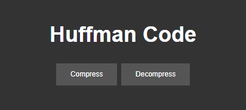

# Huffman Coding Project

This project is an implementation of Huffman Coding, a popular data compression algorithm, in Python. It includes a web interface built with Flask.



## Features

- Compress and decompress files using Huffman Coding
- View the Huffman table and frequency of characters
- View the compression rate and header of the compressed file

## Installation

1. Clone the repository:
   ```
   git clone https://github.com/Rasheed-Al-Qobbaj/Huffman-Coding.git
   ```
2. Navigate to the project directory:
   ```
   cd Huffman-Coding
   ```

## Usage

1. Run the Flask application:
   ```
   python app.py
   ```
2. Open a web browser and navigate to `http://localhost:5000`.
